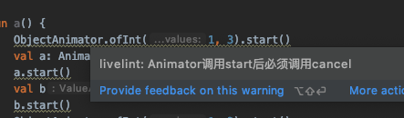
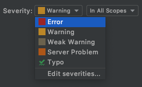
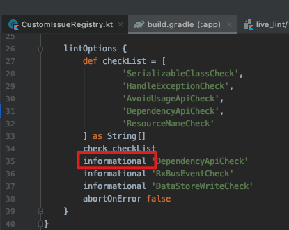

## Custom Lint Check

### 实时静态检测效果



### 使用方法一

自定义lint检查代码都在lint模块（Java Module）中；lintlibrary是一个空的Android Module，负责将livelint打出的jar包打入一个aar包中。

app模块通过compileOnly依赖livelibrary模块，相关的自定义检测就会只对该模块生效了，并且不会打入release包中。

### 使用方法二

编译完成后，将"/lint/build/libs"的"lint.jar"文件复制到（mac下）".android/lint"目录下（没有lint目录，新建一个）即可。</br>

如果没有出现实时的静态检测提示，rebuild项目，仍然失败重新Android Studio</br>

如果多次尝试仍然没有实时提示，只能使用```./gradlew lint```命令进行手动检查。</br>

**app/build/reports/lint-results.html**生成的该文件中可以查看检查的详细结果。</br>

### 控制静态检测等级

1、可以直接在Preferences-Inspections中设置问题的严重程度



Error 红色波浪线

Warning 淡黄色背景色

WeakWarning 黄色波浪线

Server Problem

2、通过lintOption进行提示等级设置



[LintOptions](https://developer.android.com/reference/tools/gradle-api/4.1/com/android/build/api/dsl/LintOptions)